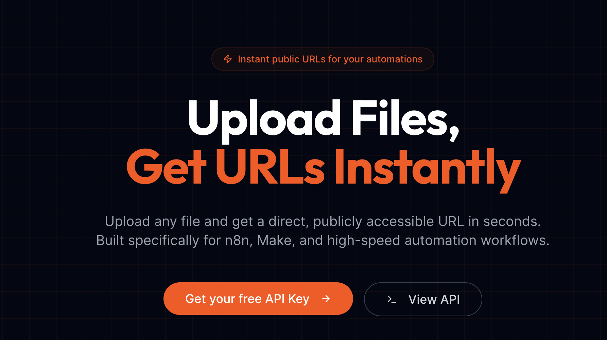
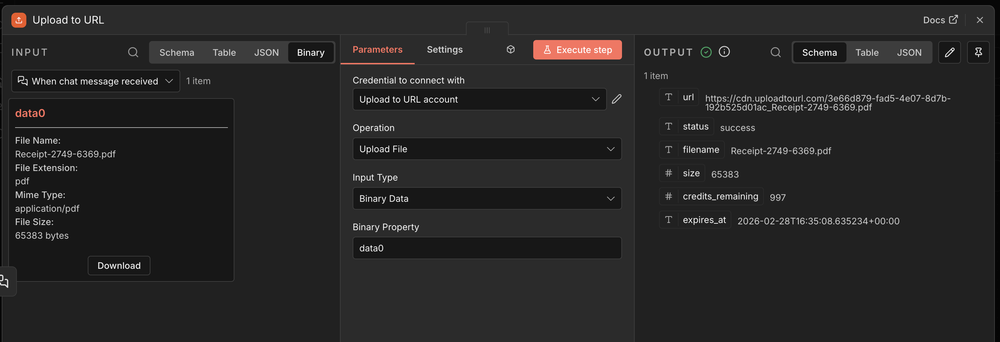
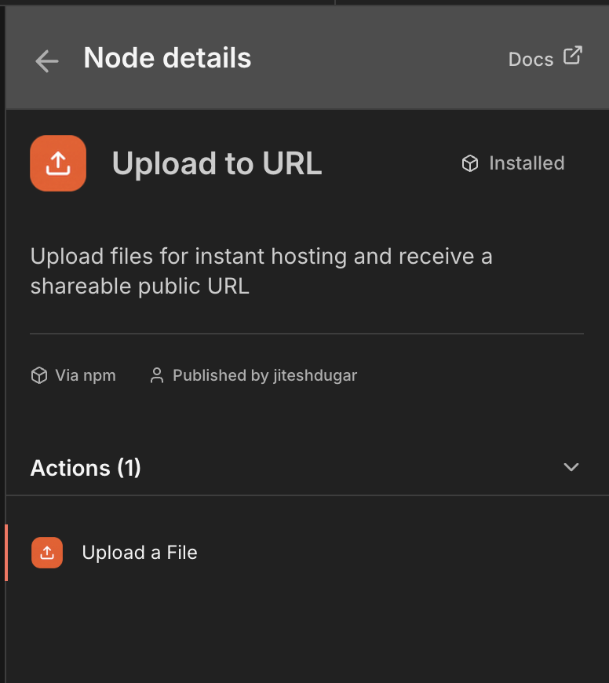

# n8n-nodes-uploadtourl

[](https://uploadtourl.com)

This is an [n8n](https://n8n.io/) community node that lets you upload any file and get a public URL instantly using [Upload to URL](https://uploadtourl.com). Supports both binary data and base64 string inputs.

[n8n](https://n8n.io/) is a [fair-code licensed](https://docs.n8n.io/reference/license/) workflow automation platform.

[Installation](#installation) |
[Operations](#operations) |
[Credentials](#credentials) |
[Usage](#usage) |
[Resources](#resources)

## Installation

Follow the [installation guide](https://docs.n8n.io/integrations/community-nodes/installation/) in the n8n community nodes documentation.

### In n8n

1. Go to **Settings > Community Nodes**
2. Select **Install**
3. Enter `n8n-nodes-uploadtourl` in the **Enter npm package name** field
4. Agree to the risks of using community nodes and select **Install**

### Manual Installation

To install this node manually in a self-hosted n8n instance:

```bash
cd ~/.n8n/nodes
npm install n8n-nodes-uploadtourl
```

Then restart your n8n instance.

## Operations

### Upload to URL

The **Upload to URL** node supports the following operation:

- **Upload File** — Upload a file (binary data or base64 string) from your workflow and receive a publicly accessible URL in response.

#### Parameters

| Parameter | Type | Default | Description |
|-----------|------|---------|-------------|
| **Input Type** | selection | `Binary Data` | Choose between "Binary Data" (from previous nodes) or "Base64 String" (direct base64 input) |
| **Binary Property** | string | `data` | The name of the binary property containing the file to upload. Only shown when Input Type is "Binary Data". |
| **Base64 Data** | string | - | Base64 encoded file data. Only shown when Input Type is "Base64 String". |
| **Filename** | string | `file.bin` | Name of the file (e.g., document.pdf, image.jpg). Required for base64 input. |
| **MIME Type** | selection | `auto` | Choose from common MIME types or select "Custom" to specify your own. Also supports "Auto-detect from filename" to automatically determine the MIME type from the file extension. |
| **Custom MIME Type** | string | - | Custom MIME type (e.g., application/vnd.ms-excel). Only shown when MIME Type is set to "Custom". |

#### Output

The node returns the JSON response from the Upload to URL API, which includes the public URL for the uploaded file.

### Supported Features



- **Multiple Input Types** — Supports both binary data from previous nodes and direct base64 string input.
- **Smart Defaults** — Filename defaults to `file.bin` and MIME type defaults to auto-detection for seamless setup.
- **Batch Processing** — Handles multiple input items; each item's file is uploaded individually.
- **Continue on Fail** — When enabled, the workflow continues even if an upload fails, returning the error message in the output instead of stopping execution.
- **Usable as Sub-Node / Tool** — Can be used as a tool in AI agent workflows and sub-workflows.

#### Supported File Types

The node supports all file types including:
- **Images**: JPEG, PNG, GIF, WebP, SVG, ICO
- **Documents**: PDF, DOC, DOCX, TXT, CSV, XLS, XLSX
- **Videos**: MP4, AVI, MOV, WMV, FLV, WebM
- **Audio**: MP3, WAV, FLAC, AAC, OGG
- **Archives**: ZIP, RAR, TAR, GZ
- **Any custom file type**

## Credentials

To use this node, you need an **Upload to URL API key**.

### Obtaining an API Key

1. Visit [uploadtourl.com](https://uploadtourl.com)
2. Create an account or sign in
3. Navigate to your API settings to generate an API key

### Setting Up Credentials in n8n

1. In n8n, go to **Credentials**
2. Select **Add Credential**
3. Search for **Upload to URL API**
4. Enter your **API Key** in the provided field
5. Select **Save**

The credential is automatically verified against the Upload to URL API when saved.

## Usage

### Node Overview

The **Upload to URL** node provides a clean interface for uploading files with support for both binary data and base64 string inputs.



### Binary Data Upload (Existing)

1. Add a node that produces binary data (e.g., **Read Binary File**, **HTTP Request**, or a **Webhook** trigger with file upload)
2. Connect it to the **Upload to URL** node
3. Set **Input Type** to "Binary Data"
4. Configure the **Binary Property** name if your binary data uses a property name other than `data`
5. Execute the workflow to upload the file and receive a public URL

### Base64 String Upload (New)

1. Add a node that produces base64 data or use a **Set** node to define base64 content
2. Connect it to the **Upload to URL** node
3. Set **Input Type** to "Base64 String"
4. Configure the following parameters:
   - **Base64 Data**: The base64 encoded string (with or without data URL prefix)
   - **Filename**: The desired filename (defaults to `file.bin` if not specified)
   - **MIME Type**: Choose from the dropdown (defaults to "Auto-detect from filename")
5. Execute the workflow to upload the file and receive a public URL

**Note**: With the default settings, you only need to provide the base64 data. The node will automatically use `file.bin` as the filename and detect the MIME type from the file extension if you change the filename to end with a proper extension (e.g., `image.jpg`).

### Base64 Input Examples

#### Example 1: Direct Base64 Input
```
[Set Node with base64 data] → [Upload to URL] → [HTTP Request with URL]
```

**Set Node configuration:**
- JSON mode: `{
  "base64Data": "iVBORw0KGgoAAAANSUhEUgAAAAEAAAABCAYAAAAfFcSJ...",
  "fileName": "image.png",
  "mimeType": "image/png"
}`

**Upload to URL configuration:**
- Input Type: "Base64 String"
- Base64 Data: `{{ $json.base64Data }}`
- Filename: `{{ $json.fileName }}`
- MIME Type: `{{ $json.mimeType }}`

#### Example 2: Data URL Input
The node automatically handles data URLs like:
```
data:image/jpeg;base64,/9j/4AAQSkZJRgABAQAAAQ...
```

Simply paste the entire data URL in the **Base64 Data** field, and the node will extract the base64 portion automatically.

#### MIME Type Options

The **MIME Type** dropdown provides several options:

- **Auto-detect from filename**: Automatically determines the MIME type based on the file extension (e.g., `.jpg` → `image/jpeg`, `.pdf` → `application/pdf`)
- **Predefined options**: Common MIME types for images, documents, videos, audio, and archives
- **Custom**: Allows you to specify any MIME type (e.g., `application/vnd.ms-excel` for Excel files)

**Supported Auto-detect Extensions**:
- Images: `.jpg`, `.jpeg`, `.png`, `.gif`, `.webp`, `.svg`
- Documents: `.pdf`, `.txt`, `.csv`, `.json`, `.xml`
- Archives: `.zip`
- Media: `.mp4`, `.mp3`
- Unknown extensions default to `application/octet-stream`

### Example Workflow

```
[Read Binary File] → [Upload to URL] → [Send Email with URL]
```

1. **Read Binary File** reads a local file and outputs it as binary data
2. **Upload to URL** uploads the file and returns a public URL
3. **Send Email** uses the returned URL to share the file link

### Using with HTTP Request

```
[HTTP Request (download file)] → [Upload to URL] → [Slack Message with URL]
```

1. **HTTP Request** downloads a file from any source
2. **Upload to URL** re-hosts the file and provides a permanent public URL
3. **Slack** sends a message containing the file link

### Using in AI Agent Workflows

The node is marked as **usable as a tool**, so it can be used within n8n's AI Agent node. This allows an AI agent to upload files and retrieve public URLs as part of its reasoning process.

## Development

### Prerequisites

- [Node.js](https://nodejs.org/) v22 or higher
- npm

### Setup

```bash
git clone https://github.com/jiteshdugar/n8n-nodes-uploadtourl.git
cd n8n-nodes-uploadtourl
npm install
```

### Available Scripts

| Script | Description |
|--------|-------------|
| `npm run dev` | Start n8n with the node loaded and hot reload enabled |
| `npm run build` | Compile TypeScript to JavaScript for production |
| `npm run build:watch` | Build with watch mode (auto-rebuild on changes) |
| `npm run lint` | Check code for errors and style issues |
| `npm run lint:fix` | Auto-fix linting issues |
| `npm run release` | Create a new release |

### Local Development

```bash
npm run dev
```

This starts n8n with your node available at [http://localhost:5678](http://localhost:5678) and automatically rebuilds when you make changes.

## Resources

- [n8n Community Nodes Documentation](https://docs.n8n.io/integrations/community-nodes/)
- [Upload to URL Website](https://uploadtourl.com)
- [n8n Community Forum](https://community.n8n.io/)

## License

[MIT](LICENSE.md)
